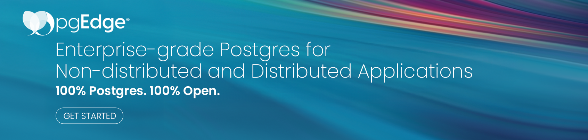

  <a href="https://www.pgedge.com">Learn more</a> •
  <a href="https://docs.pgedge.com">Docs</a> •
  <a href="https://discord.com/invite/pgedge/login">Discord</a> •
  <a href="https://www.linkedin.com/company/pgedge/">LinkedIn</a> •
  <a href="https://mastodon.social/@pgEdgeDistributedPostgres">Mastodon</a>

##

With pgEdge, get 100% open-source, enterprise-grade Postgres out-of-the-box optimized for both non-distributed and distributed deployments.

pgEdge delivers PostgreSQL solutions for maximum high availability, ultra-low latency, zero downtime maintenance, and data residency across deployment options and cloud regions. Single instances can be scaled up to active-active (multi-master) distributed deployments in a matter of minutes, giving you the freedom and flexibility to shift your data needs for your business instantly.

Proudly 100% open-source (under the OSI-approved [PostgreSQL license](https://www.postgresql.org/about/licence/)) and [100% PostgreSQL compatible](https://pgscorecard.com/), we're here to help you enable scalable, flexible, and fault-tolerant Postgres deployments no matter where your clusters are.
pgEdge stays up-to-date with the latest PostgreSQL releases with same-day patches, ensuring that all the most recent enhancements, bug fixes, and security updates for each release are available without delay.

## What's at our core

- [Built upon 100% pure PostgreSQL](https://postgresql.org)
- [Spock, for enabling active-active replication with appropriate conflict resolution](https://github.com/pgEdge/spock)

## Download & install

We have a variety of download options available to make it quick and easy to start using pgEdge.

- Sign up for the Cloud Edition and get the first 30 days free.
     - [pgEdge Distributed Postgres](https://www.pgedge.com/get-started/cloud)
     - [pgEdge Enterprise Postgres](https://www.pgedge.com/get-started/enterprise-cloud)
- Experience self-hosted pgEdge in 30 seconds when deploying using containers. Free for development or evaluation.
     - [pgEdge Distributed
 Postgres](https://www.pgedge.com/get-started/containers)
     - [pgEdge Enterprise Postgres](https://www.pgedge.com/get-started/enterprise-containers)
- Self-host on VMs with a free download license for unlimited development and evaluation.
     - [pgEdge Distributed Postgres](https://www.pgedge.com/get-started/platform)
     - [pgEdge Enterprise Postgres](https://www.pgedge.com/get-started/enterprise-vm)

### Integrations 

- [Prefer using Ansible to deploy infrastructure and cluster resources?](https://github.com/pgEdge/pgedge-ansible) This collection will build a pgEdge Distributed Postgres cluster for you.
- Leverage [Postgres images built from pgEdge Enterprise packages](https://github.com/pgEdge/postgres-images)
- Install pgEdge Distributed Postgres using a [Helm chart](https://github.com/pgEdge/pgedge-helm) to deploy quickly on Kubernetes.
- Explore [Dockerfile and Docker examples for pgEdge Distributed Postgres](https://github.com/pgEdge/pgedge-docker).
- [Connect Cloudflare Workers to your pgEdge Cloud database](https://github.com/pgEdge/cloudflare-worker-template) using our template.
- Working with [Terraform](https://github.com/pgEdge/terraform-provider-pgedge)? Our pgEdge Cloud terraform provider works seamlessly for both the Developer and Enterprise editions.
- Simplify the management of pgEdge Cloud resources using infrastructure as code with the [official Pulumi provider for pgEdge Cloud](https://github.com/pgEdge/pulumi-pgedge).

## Get started

Self-hosting pgEdge? [Find the installation instructions here.](https://docs.pgedge.com/platform/installing_pgedge)

Or, thinking of deploying in the cloud? [Learn more about pgEdge Cloud deployments here.](https://docs.pgedge.com/cloud)

## Developer resources

- [Blog](https://www.pgedge.com/blog)
- [FAQ](https://www.pgedge.com/resources/faq)
- [Demos](https://www.pgedge.com/demo-video)
- [YouTube](https://www.youtube.com/@pgEdge)

## Contact us, anytime

We provide [24/7 customer service](https://www.pgedge.com/support) for customers with thanks to our amazing team of experts, that includes contributors to the PostgreSQL ecosystem.

If you have any specific questions about pgEdge in general, you can always [get in touch](https://www.pgedge.com/contact) and we're happy to help.

Otherwise, for technical questions, we're active on [Discord](https://discord.com/invite/pgedge/login) and are happy to help answer any queries there.

_Follow us on social_:

- [LinkedIn](https://www.linkedin.com/company/pgedge/)
- [Mastodon](https://mastodon.social/@pgEdgeDistributedPostgres)
- [Discord](https://discord.com/invite/pgedge/login)
- [X](https://twitter.com/pgEdgeInc)
